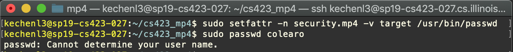

# cs423_mp4

CS 423 MP4 - Linux Security Module Implementation

# Introduction 

This the README document of the CS423 MP3, writen by Kechen Lu (kechenl3), is for introducing How-to and the basic implementation ideas of this machine problem, which aims to implement a new LSM which accomplished the basic tasks to control the access of target process to the files in the certain assigned extended attributes.

This module is compiled in the Linux Kernel v4.4 which is running over the VM the MP0 has done that. 

Basically, this module is the static module which is required to load at the machine booting time and not like the dynamic loadable modules we implemented before. And we need to implement six hook functions including inode_init_security, inode_permission, berm_set_creds, cred_alloc_blank, cred_free, cred_prepare and two helper functions including get_inode_sid and mp4_has_permission. 

# Module Design

## Hooks and Helpers 

**mp4_cred_alloc_blank**: allocate memory for the new credentials (security field in the structure cred), and defaultly the security structure is the type of void *, which we convert it to mp4_security, and assign the defualt value MP4_NO_ACCESS to its field mp4_flags.

**mp4_cred_free**: just free the pointer cred->security.

**mp4_cred_prepare**: prepare has two credentials passed in, so except we need to call the **mp4_cred_alloc_blank** for the new credential, if the old is not NULL, we should copy the flag of old security->mp4_flag to the new. If we do not have if statement, the copy from the old could be NULL. 

**mp4_inode_init_security**: for a newly created inode, in the module we have to assign the extended attribute to the inode if the current task security flag is "target". So if we run a target process and it creates a new inode, we want to set the attribute "read-write" if file and "dir-write" if directory for this newly created one. In the implementation, the name is char** pointer, and and we use the kstrndup() to allocate the memory and copy the attribute name to this memory area. Plus, we would to copy the attribute value as well using the sprintf and assign the length. Note that we should assign the name using XATTR_MP4_SUFFIX instead of XATTR_NAME_MP4. 

**mp4_bprm_set_creds**: this function is for the executable binary file, and we could get the inode from the bprm->file->f_inode and using the helper function to get the binary corresponding attribute. If the attr is target, then we would like to assign the target attribute to the binary preparasion structure.

**get_inode_sid**: this is the helper function to get the attribute from the inode. We get the dentry through `d_find_alias` and allocate a memory to store the getxattr value. If there are some inode not having implemented the inode->i_op->getxattr function, just return the error, and let the caller to determine how to handle this. One thing needed to notice is that if we first getxattr returning -ERANGE, means the allocated buffer size is too small. So as the SELinux does, we would query the length of attribute first and then allocate the buffer with length, and then recall the getxattr.

**mp4_has_permission**: this is the core function for the access control of this LSM. We have input **ssid** and **osid** and the permission request **mask**. Using the switch to branch the **osid** and depending on different **ssid**, we have the permission control according to the document. Since the requesting permission mask may include more than one bit mask, so we use the **(mask & (all bit masks this object have)) == mask** to determine if the requested permission mask is the subset of the current owning permissions.

**mp4_inode_permission**: this last function is to check the permission when accessing the inode permissions. We use the `dentry_path_raw` to get the path, and leverage the returned path to check if the path could be skipped. From the given inode, we get the osid, object sid. Using the mp4_has_permission function to check if the subject has the access to the object with mask. If not, return -EACCES and log it.

## Test the Module

We have several test cases to make sure if our module work correctly.  We have the attributes setting up like below. 

```bash
sudo setfattr -n security.mp4 -v target /bin/cat
sudo setfattr -n security.mp4 -v target /bin/touch
sudo setfattr -n security.mp4 -v target /usr/bin/vim
sudo setfattr -n security.mp4 -v target /bin/echo
sudo setfattr -n security.mp4 -v target /bin/bash
sudo setfattr -n security.mp4 -v exec /home/kechenl3/test_script.sh
sudo setfattr -n security.mp4 -v dir /home
sudo setfattr -n security.mp4 -v dir-write /home/kechenl3
sudo setfattr -n security.mp4 -v read-only /home/kechenl3/file.txt
sudo setfattr -n security.mp4 -v read-write /home/kechenl3/file_2.txt
```

- **Test dir-write**: When we test the mkdir target process in the dir-write directory, we could successfully do it. But, if we mkdir in other directory, we would fail like the two figures below.


- **Test read-only**: We use cat target process to read the file.txt, and obviously it could succeffully be executed.  But when we use the echo to write the file.txt, it would fail, and log the DENY message.


- **Test read-write**: We write a test_write.c function to test the target process performing the write and "cat" to perform the read. We have set the file_2.txt to have the read-write permission, and use the test_write binary target process to write a sentence to the file_2.txt. We can see there is no deny error related to file_2.txt and the file_2.txt finally have the written sentence with "cat" as well as the target process to read it. So we could conclude that the read-write access control logic perform well.

  

- **Test create a new file **: We would like to have the /bin/touch as target, and use touch to create a new file. As the figure below shows that the new created file has the attribute "read-write".


- **Test exec**: we test the script file running and thus we can see this script has execute attribute and successfully run it.


## Least Privilege Policy

First we use the `strace` to track the system call by the /usr/bin/passwd command. Using the command below to have the strace output to strace_passwd.log.

```bash
sudo strace -o strace_passwd.log passwd colearo
cat strace_passwd.log
kechenl3@sp19-cs423-027:~/cs423_mp4$ cat strace_passwd.log |grep open
open("/etc/ld.so.cache", O_RDONLY|O_CLOEXEC) = 3
open("/lib/x86_64-linux-gnu/libpam.so.0", O_RDONLY|O_CLOEXEC) = 3
open("/lib/x86_64-linux-gnu/libpam_misc.so.0", O_RDONLY|O_CLOEXEC) = 3
open("/lib/x86_64-linux-gnu/libselinux.so.1", O_RDONLY|O_CLOEXEC) = 3
open("/lib/x86_64-linux-gnu/libc.so.6", O_RDONLY|O_CLOEXEC) = 3
open("/lib/x86_64-linux-gnu/libaudit.so.1", O_RDONLY|O_CLOEXEC) = 3
open("/lib/x86_64-linux-gnu/libdl.so.2", O_RDONLY|O_CLOEXEC) = 3
open("/lib/x86_64-linux-gnu/libpcre.so.3", O_RDONLY|O_CLOEXEC) = 3
open("/lib/x86_64-linux-gnu/libpthread.so.0", O_RDONLY|O_CLOEXEC) = 3
open("/proc/filesystems", O_RDONLY)     = 3
open("/usr/lib/locale/locale-archive", O_RDONLY|O_CLOEXEC) = 3
open("/proc/self/loginuid", O_RDONLY)   = 3
...
```

Then we implement a parser to get all the open system call, and its corresponding O_RDONLY|O_RDRW|O_WRONLY and other permission requests. And we filter all the open() system call with error return value. So we get the basic file-permission map. And then we need to figure out how many directories we need to access which contains these files. For the directories, we get these having **dir-write** permission. And for O_RDONLY to **read-only**, O_WRONLY to **write-only**, O_RDWR to **read-write**. 

Basically, we could know from the strace log that there are some files deserving to note, passwd running needs to read the linkable library (.so) files and the files in the /etc. The passwd.perm and passwd.perm.unload is in this directory. The files except the linkable library .so are listed as below.

```bash
sudo setfattr -n security.mp4 -v read-only /etc/pam.d/common-account
sudo setfattr -n security.mp4 -v read-only /etc/pam.d/common-session
sudo setfattr -n security.mp4 -v write-only /etc/.pwd.lock
sudo setfattr -n security.mp4 -v read-only /etc/passwd
sudo setfattr -n security.mp4 -v read-only /dev/urandom
sudo setfattr -n security.mp4 -v read-only /etc/nsswitch.conf
sudo setfattr -n security.mp4 -v read-only /etc/localtime
sudo setfattr -n security.mp4 -vsudo setfattr -n security.mp4 -v dir-write /etc/pam.d
sudo setfattr -n security.mp4 -v dir-write /etc
sudo setfattr -n security.mp4 -v read-only /etc/pam.d/common-password
 read-only /etc/pam.d/other
sudo setfattr -n security.mp4 -v read-only /etc/pam.d/common-auth
sudo setfattr -n security.mp4 -v read-only /etc/pam.d/passwd
sudo setfattr -n security.mp4 -v read-only /etc/passwd
sudo setfattr -n security.mp4 -v read-only /etc/login.defs
```

As the figure below shows that we run the passwd.perm, after setting the attributes, the passwd could be run successfully and update the password successfully. The dmesg shows we have some deny, but these file accesses are not the strace getting, and these deny implies that we successfully implement the least privilege policy and the normal functionality of the /usr/bin/passwd successfully performed. And we can see if we only set the passwd as target, and do not assign attributes to other files it needs access, the passwd running would fail. The fail dmesg shows that this passwd running fails because /etc read is not allowed.




# How-to

## How-to Compile and Install

```bash
 make -j 8 LOCALVERSION=-kechenl3 bindeb-pkg
```

Running the compile command to make the kernel. The Kconfig and Makefile reside in this mp4 directory.

```bash
sudo dpkg -i linux-headers-4.4.0-kechenl3_4.4.0-kechenl3-*_amd64.deb 
sudo dpkg -i linux-image-4.4.0-kechenl3_4.4.0-kechenl3-*_amd64.deb 
```

